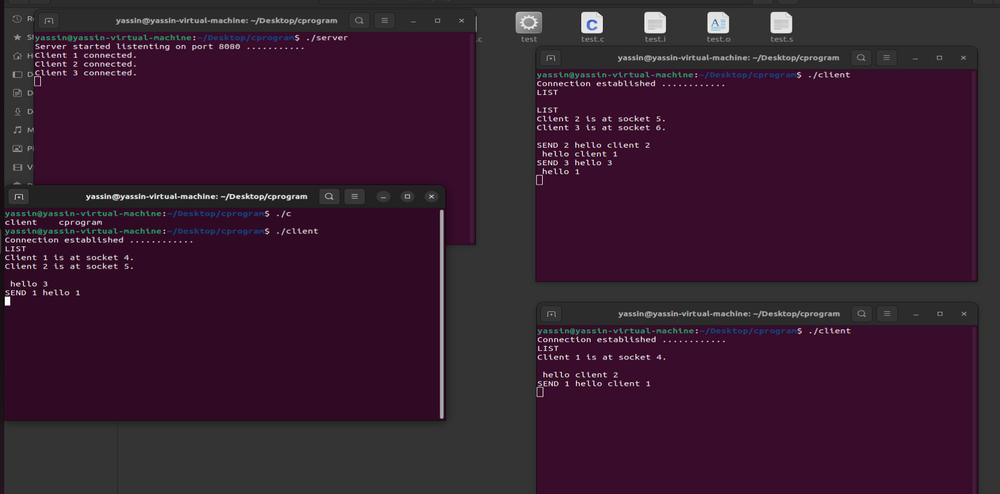

# ChatApp_with_Sockets_in_C

This mini-project consists of building a chat app with sockets using the C programming language. Here are the instructions on how to run this code:

1-Compile the server and client source code by running the following commands:

gcc server.c -o server

gcc client.c -o client

2-Start the server by running the server:
./server

3-Open one or more terminals and run the client code.
./client

4-Once the clients is connected to the server, you can send messages but first you need to:
	+ Choose the receviver use command LIST to list all the users connected to the server
	+ Now To send message write: SEND user_number your_message 
 
The following image provide more information about how to run this code:

